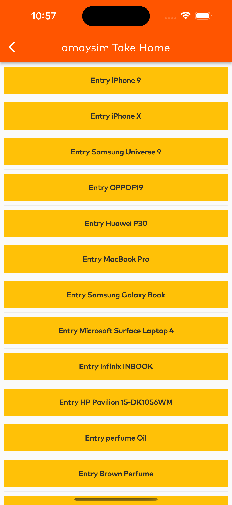
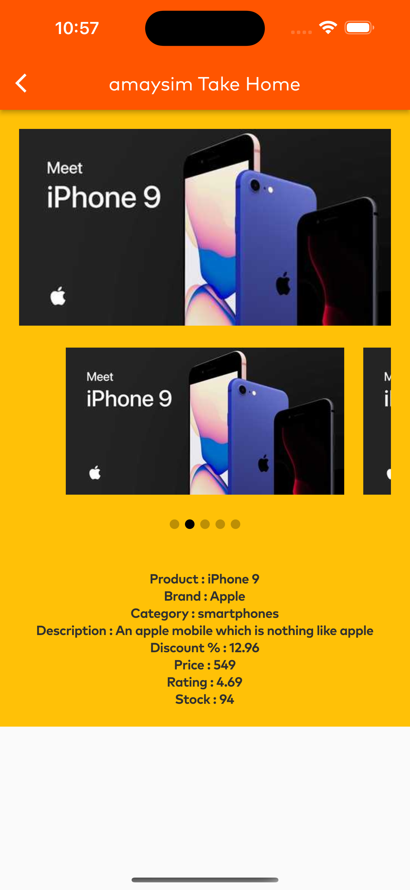
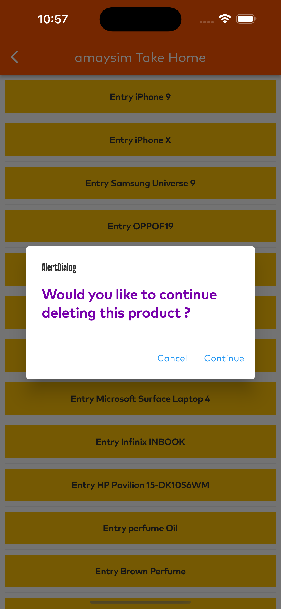

     &nbsp; &nbsp; 

---

# amaysim Take Home Test - Flutter

For current open positions, see https://www.amaysim.com.au/about/careers/

---

## Welcome!

If you are reading this then we're likely in the process chatting with you about a technical role at amaysim on our apps team. If so, congratulations 🎉 !

In order to move forward, we'd like to know a little about how you work. To that end, this repository contains a set of short, time-boxed exercises that you can use to demonstrate your skills and abilities.

The exercises are based on our tech stack. Complete as many as you like to showcase to us your abilities, spending no more than 3-4 hours max. We know that 3-4 hours is not a lot of time and you will likely not be able to complete everything you'd like. Feel free to add notes to your PR on the things you would improve with more time.

## Getting started

Follow the [install instructions](https://flutter.io/setup-macos/) to setup Flutter.

For help getting started with Flutter, view the official [online documentation](https://flutter.dev/docs), which offers tutorials, samples, guidance on mobile development, and a full API reference.

Here are a few resources we've found useful to get started:

- [Lab: Write your first Flutter app](https://flutter.dev/docs/get-started/codelab)
- [Cookbook: Useful Flutter samples](https://flutter.dev/docs/cookbook)

Clone your repository

    git clone https://github.com/work-for-amaysim/flutter-take-home-test-<YOUR_USERNAME>.git
    
Install dependencies

    cd app && flutter pub get

Launch a simulator and run the demo app

    open -a simulator
    flutter run --debug

## About the demo app

The demo application connects to `https://dummyjson.com/` to get a single product.

With [DummyJSON](https://dummyjson.com/), you get different types of REST Endpoints filled with JSON data which you can use while developing without worrying about writing any backend.

Check out the [dummyjson.com docs](https://dummyjson.com/docs) for usage examples to help you focus on building a cool app experience.

## Exercises

Choose an exercise(s) that matches you. This is the area in which you feel the most comfortable and have the highest degree of mastery. [DummyJSON](https://dummyjson.com/) has APIs for all of these.

- _Exersise #1:_ Add a sceeen to display many products, in a list or grid - Done
- _Exersise #2:_ Allow users to tap a listed product, to display product details - Done
- _Exersise #3:_ Allow users to add/remove a product, to/from a cart - Done
- _Exersise #4:_ Add loading state, so users get feedback while waiting for an API response - Done
- _Exersise #5:_ Add error handling, to show a user-friendly error message if an API call fails - Done

## How to submit?

When you're happy with your changes, create a PR and email us the link. Be sure to include the following in your submission;

- Screenshots of the finished product. Show off that work! 📸
- Added in assets folder
- 
- 
- 
- 
- Any supporting documentation required to run your app

Sit back and relax. We'll review your submission and get back to you 😃
